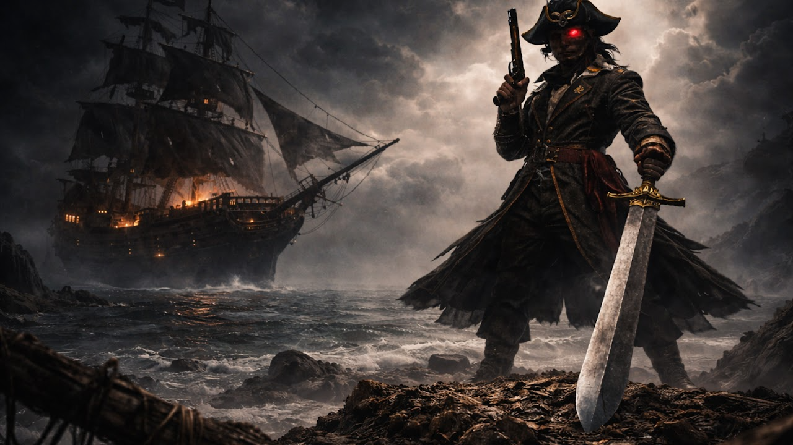

  

  # ⚓ NIHALSAILOR
  ### Captain of the Digital Seas • Game Developer & Ethical Hacker

  
  
  
  
  
  

  

    <em>"The sea rewards only those who hold the helm when the sky burns."</em>
  

---

## 🏴‍☠️ About Captain Nihalsailor

Welcome to the official repository and flagship portal of **Nihalsailor**. 

- 🎮 **Passions:** Game Development (Unity 3D / Unreal / WebGL), Ethical Hacking & Systems Security.
- ⚡ **Core Craft:** Engineering resilient multiplayer games, distributed systems, and atmospheric dark-fantasy web experiences.
- 🌐 **Live Flagship:** [**https://nihalsailor.github.io/nihalsailor/**](https://nihalsailor.github.io/nihalsailor/)
- ⚓ **Web Portal:** [**https://itlive.in/nihalsailor/index.html**](https://itlive.in/nihalsailor/index.html)
- 📺 **YouTube:** [**https://www.youtube.com/@nihalsailor**](https://www.youtube.com/@nihalsailor)

---

## 🚢 The Armada (Featured Projects)

| Vessel / Project | Focus Area | Tech Stack |
| :--- | :--- | :--- |
| **WRX Battles Online** | Multiplayer Combat Warfare | Unity 3D, C#, Photon, PhysX |
| **ApaniBaat** | Real-Time Encrypted Messaging | Full-Stack, WebSockets, Node.js, React |
| **StreamSailor Suite** | Creator Broadcast Deck & DSP | Python, OBS WebSockets, Audio DSP |
| **ZAI Security Radar** | Ethical Hacking & Recon | Python, Network Security, Docker |
| **SafeGuard Lite** | Security & Policy Enforcement | Android, C#, Local Firewall, SQLite |
| **Ghost Galleon 3D** | Browser Ocean Simulator | Three.js, GLSL Shaders, WebAudio |

---

## ⚔️ The Arsenal & Specializations

- **Game Engineering:** Unity 3D, C#, WebGL, Multiplayer Synchronization, PhysX Vehicle Dynamics, Shaders.
- **Cyber Security & Hacking:** Network Penetration Reconnaissance, Local Firewalls, Zero-Trust Encryption, Docker Security.
- **Creative Web Systems:** Three.js, Web Audio DSP, Next.js / React, WebSockets, Dark Aesthetic Design.

---

## 📬 Direct Coordinates

- 🌐 **Web Portal:** [itlive.in/nihalsailor](https://itlive.in/nihalsailor/index.html)
- 📺 **YouTube Channel:** [@nihalsailor](https://www.youtube.com/@nihalsailor)
- 📸 **Instagram:** [@nihalsailor](https://instagram.com/nihalsailor)
- 🐙 **GitHub:** [@nihalsailor](https://github.com/nihalsailor)
- 📧 **Direct Email:** [nihalsailor14@gmail.com](mailto:nihalsailor14@gmail.com)

---

  © 2026 Nihalsailor • Charting Uncharted Digital Horizons

